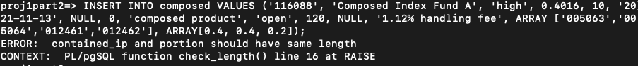
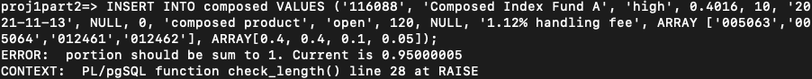
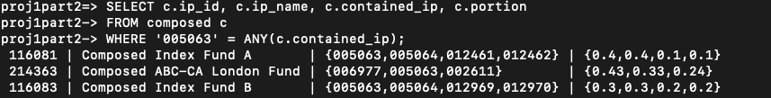

# COMS4111-project2
<center><i>TEAM MEMBER: Jiaqing Chen(uni: jc5657), Lukas Wang(uni: bw2712)</i></center>

## Abstract
In this project we will modify the schema we have in project 1 to accommodate the following features
- **TEXT**
- **Arrays**
- **Composite type**
- **Trigger**

## Database
### Account
jc5657
### Command to enter the database
psql -U jc5657 -h 34.74.246.148 -d proj1part2
### Password
jc5657
## New Schema

```sql
--- Type for risk
create type risk AS ENUM ('high', 'medium', 'low');

--- Type for status
create type status AS ENUM ('open', 'closed');

--- Change type and change text to ip
create table Investment_Product_new (
    IP_id VARCHAR(20),
    IP_name VARCHAR(100) NOT NULL, 
    Risk_type risk NOT NULL, 
    Curr_yield REAL NOT NULL CHECK (Curr_yield>=0), 
    Min_inv_value REAL NOT NULL CHECK (Min_inv_value>=0), 
    Create_date DATE,
    Expire_date DATE,
    Freezing_time INTEGER NOT NULL CHECK (Freezing_time>=0), 
    Note TEXT,
    Status status NOT NULL, 
    Curr_value REAL CHECK (Curr_value>=0),
    Exp_value REAL CHECK (Exp_value>=0 OR Exp_value=NULL),
    Description TEXT,

    PRIMARY KEY (IP_id), 
    UNIQUE (IP_name)
);

CREATE FUNCTION check_length() RETURNS trigger AS $check_length$
    DECLARE
        i integer; 
        test real;
    BEGIN
        -- Check that contained_ip and portion are given
        IF NEW.contained_ip IS NULL THEN
            RAISE EXCEPTION 'contained_ip cannot be null';
        END IF;
        IF NEW.portion IS NULL THEN
            RAISE EXCEPTION 'portion cannot be null';
        END IF;

        -- Check the length of contained_ip and portion are same
        IF CARDINALITY(NEW.contained_ip) != CARDINALITY(NEW.portion) THEN
            RAISE EXCEPTION 'contained_ip and portion should have same length';
        END IF;

        -- Check portion sum to 1
		--- Very weird some real values "seemly" could add to 1.0 (e.g. 0.4, 0.3, 0.11, 0.09, 0.1) are added to 1.000001 in sql, so we add some tolerance for this sum operation.
        IF (SELECT SUM(t) FROM UNNEST(NEW.portion) t) >= 1.00001 or (SELECT SUM(t) FROM UNNEST(NEW.portion) t) <= 0.99999 THEN
            SELECT INTO test SUM(t) FROM UNNEST(NEW.portion) t;
            RAISE EXCEPTION 'portion should be sum to 1. Current is %', test;
        END IF;

        -- Check portion are all greater than 0
        FOR i IN array_lower(NEW.portion, 1) .. array_upper(NEW.portion, 1)
        LOOP
            IF NEW.portion[i] <= 0 THEN
                RAISE EXCEPTION 'portion should greater than 0';
            END IF;
        END LOOP;

        RETURN NEW;
    END;
$check_length$ LANGUAGE plpgsql;

CREATE TRIGGER check_length BEFORE INSERT OR UPDATE ON composed
    FOR EACH ROW EXECUTE FUNCTION check_length();

--- Create new type of product: composed, combining different portition of  
create table composed(
    IP_id VARCHAR(20),
    contained_ip VARCHAR(20)[10] NOT NULL,
    portion REAL[10] NOT NULL,
    PRIMARY KEY(IP_id)
)
INHERITS(Investment_Product_new);

create table stock_new(
    IP_id VARCHAR(20),
    Capital_price REAL CHECK (Capital_price>=0),
    Open_price REAL NOT NULL CHECK (Open_price>=0), 
    Close_price REAL NOT NULL CHECK (Close_price>=0),

    PRIMARY KEY(IP_id)
)
INHERITS(Investment_Product_new);

create table bond_new(
    IP_id VARCHAR(20),
    Maturity INTEGER NOT NULL CHECK (Maturity>=0),
    Face_value REAL NOT NULL CHECK (Face_value>=0),
    Issue_price REAL NOT NULL CHECK (Issue_price>=0),

    PRIMARY KEY(IP_id)
)
INHERITS(Investment_Product_new);

create table gold_new(
    IP_id VARCHAR(20),
    Gold_price REAL NOT NULL CHECK (Gold_price>=0),

    PRIMARY KEY(IP_id)
)
INHERITS(Investment_Product_new);
```


### Text

We change some long text variable into text. As we need to define the maximum length for VARCHAR, it is not reasonable in some cases as we could not always sure the how long the input will be. So we change the type for ***Note*** and ***Description*** from VARCHAR to TEXT. 

```SQL
create table Investment_Product_new (
    IP_id VARCHAR(20),
    IP_name VARCHAR(100) NOT NULL, 
    Risk_type risk NOT NULL, 
    Curr_yield REAL NOT NULL CHECK (Curr_yield>=0), 
    Min_inv_value REAL NOT NULL CHECK (Min_inv_value>=0), 
    Create_date DATE,
    Expire_date DATE,
    Freezing_time INTEGER NOT NULL CHECK (Freezing_time>=0), 
    Note TEXT,
    Status status NOT NULL, 
    Curr_value REAL CHECK (Curr_value>=0),
    Exp_value REAL CHECK (Exp_value>=0 OR Exp_value=NULL),
    Description TEXT,

    PRIMARY KEY (IP_id), 
    UNIQUE (IP_name)
);
```

### Array

We add a new type of investment product called ***composed*** besides of orignial glod, stock and bond. This product combines different investment product with corresponding portion to generate a brand-new comprehensive product.

```SQL
create table composed(
    IP_id VARCHAR(20),
    contained_ip VARCHAR(20)[10] NOT NULL,
    portion REAL[10] NOT NULL,
    PRIMARY KEY(IP_id)
)
INHERITS(Investment_Product_new);
```

### Composite type
Instead of tediously using "check or" condition to check the legalization of the risk and status values for investment product. We delicately create types for them to combine them into one type and use this type to define corresponding variable.

```SQL
create type risk AS ENUM ('high', 'medium', 'low');

create type status AS ENUM ('open', 'closed');
```

### Trigger

We use trigger to guarantee the legalization of the values for composed with the following consideration:
- Array contained_ip and portion cannot be empty, otherwise this product makes not sense.
- The length of array contained_ip and portion must be same as each investment product contained in this product should have its corresponding portion and vice versa.
- All the number in array portion should be sum to 1 (obvious) <br>
  *`Remark:` It's weird here as some real values sums to 1.0 (e.g. 0.4, 0.3, 0.11, 0.09, 0.1) are added to 1.000001 in sql, so we add some tolerance for this sum operation. using <br> `IF (SELECT SUM(t) FROM UNNEST(NEW.portion) t) >= 1.00001 or (SELECT SUM(t) FROM UNNEST(NEW.portion) t) <= 0.99999 THEN`*
- All the number in array portion should be greater than 0 (obvious)
  
```SQL
CREATE FUNCTION check_length() RETURNS trigger AS $check_length$
    DECLARE
        i integer; 
        test real;
    BEGIN
        IF NEW.contained_ip IS NULL THEN
            RAISE EXCEPTION 'contained_ip cannot be null';
        END IF;
        IF NEW.portion IS NULL THEN
            RAISE EXCEPTION 'portion cannot be null';
        END IF;

        IF CARDINALITY(NEW.contained_ip) != CARDINALITY(NEW.portion) THEN
            RAISE EXCEPTION 'contained_ip and portion should have same length';
        END IF;

        IF (SELECT SUM(t) FROM UNNEST(NEW.portion) t) >= 1.00001 or (SELECT SUM(t) FROM UNNEST(NEW.portion) t) <= 0.99999 THEN
            SELECT INTO test SUM(t) FROM UNNEST(NEW.portion) t;
            RAISE EXCEPTION 'portion should be sum to 1. Current is %', test;
        END IF;

        FOR i IN array_lower(NEW.portion, 1) .. array_upper(NEW.portion, 1)
        LOOP
            IF NEW.portion[i] <= 0 THEN
                RAISE EXCEPTION 'portion should greater than 0';
            END IF;
        END LOOP;

        RETURN NEW;
    END;
$check_length$ LANGUAGE plpgsql;

CREATE TRIGGER check_length BEFORE INSERT OR UPDATE ON composed
    FOR EACH ROW EXECUTE FUNCTION check_length();
```

## Three meaningful queries

### Query 1

We want to test the trigger function in this query. In the first case, we tried to insert a composed product with portion array length != contained_ip array length. In the second case, we tried to insert a composed product with the sum of all portions not equal to 1. Both insertion attempts fail under the trigger checking.

```SQL
INSERT INTO composed VALUES ('116088', 'Composed Index Fund A', 'high', 0.4016, 10, '2021-11-13', NULL, 0, 'composed product', 'open', 120, NULL, '1.12% handling fee', ARRAY ['005063','005064','012461','012462'], ARRAY[0.4, 0.4, 0.2]);
```

```SQL
INSERT INTO composed VALUES ('116088', 'Composed Index Fund A', 'high', 0.4016, 10, '2021-11-13', NULL, 0, 'composed product', 'open', 120, NULL, '1.12% handling fee', ARRAY ['005063','005064','012461','012462'], ARRAY[0.4, 0.4, 0.1, 0.05]);
```


### Query 2

The second query is to find all the composed products which include ip_id='005063' product as one of the components.
```SQL
SELECT c.ip_id, c.ip_name, c.contained_ip, c.portion
FROM composed c
WHERE '005063' = ANY(c.contained_ip);
```


### Query 3

The third query is to find out which composed product includes the keyword "mutual fund" in its note.

```SQL
SELECT c.ip_id, c.ip_name, c.note
FROM composed c
WHERE to_tsvector(c.note) @@ to_tsquery('mutual & fund');
```

